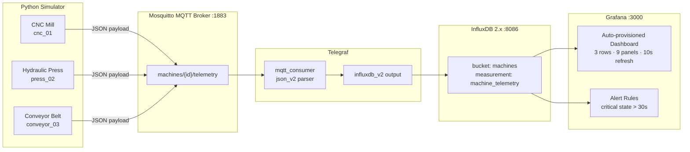
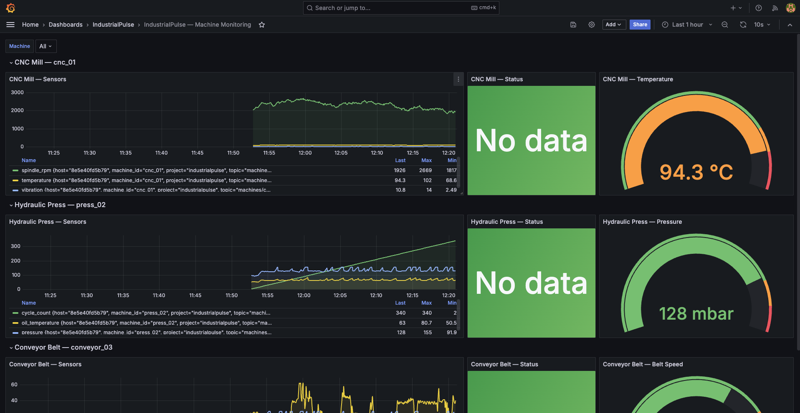

<div align="center">

# IndustrialPulse

**Real-time IoT/SCADA equipment monitoring — MQTT · InfluxDB · Grafana · Telegraf**

[](https://docs.docker.com/compose/)
[](https://www.python.org/)
[](https://www.influxdata.com/)
[](https://grafana.com/)
[](https://mosquitto.org/)

</div>

---

IndustrialPulse simulates three industrial machines — a CNC Mill, a Hydraulic Press, and a Conveyor Belt — each publishing live sensor telemetry via MQTT every 5 seconds. The full observability stack ingests, stores, and visualises data with zero manual setup after `docker compose up`.

## Architecture



## Machines & Sensors

| Machine | ID | Key Sensors | Warning | Critical |
|---|---|---|---|---|
| CNC Mill | `cnc_01` | temp (°C), vibration (mm/s), spindle_rpm | temp > 85 \| vib > 7 | temp > 95 \| vib > 10 |
| Hydraulic Press | `press_02` | pressure (bar), oil_temperature (°C), cycle_count | pres > 130 \| oil > 65 | pres > 145 \| oil > 75 |
| Conveyor Belt | `conveyor_03` | belt_speed (m/s), motor_current (A), items_per_min | speed < 0.3 \| > 2.3 \| cur > 18 | speed < 0.1 \| > 2.5 \| cur > 22 |

Each machine runs a **random-walk** simulation with a **10% per-cycle probability** of a fault event that elevates readings into warning or critical ranges for 3–8 cycles before recovering automatically.

## Quick Start

```bash
# 1. Clone
git clone https://github.com/gpana/industrialpulse.git && cd industrialpulse

# 2. Configure environment
cp .env.example .env        # optionally edit passwords

# 3. Launch the full stack
docker compose up --build
```

Open Grafana at **http://localhost:3000** → username `admin` → password from `.env`.

The **IndustrialPulse — Machine Monitoring** dashboard auto-provisions under the *IndustrialPulse* folder.

## Dashboard



*Screenshot placeholder — run the stack and capture your own live dashboard.*

The dashboard includes:
- **3 rows** — one per machine
- **Time series** panels — all sensor trends over the last hour
- **Stat** panels — current status with colour coding (green / orange / red)
- **Gauge** panels — key metric at a glance with threshold markers
- **Machine** dropdown variable for targeted filtering
- **10-second auto-refresh**

## Alert Rules

Three Grafana alert rules are provisioned automatically (no manual setup):

| Alert | Trigger | Condition |
|---|---|---|
| `cnc_01_critical` | CNC Mill | status = "critical" for > 30 s |
| `press_02_critical` | Hydraulic Press | status = "critical" for > 30 s |
| `conveyor_03_critical` | Conveyor Belt | status = "critical" for > 30 s |

Alerts appear in Grafana's Alerting UI under *General* and fire to the default contact point.

## Project Layout

```
industrialpulse/
├── docker-compose.yml          # full stack orchestration
├── .env.example                # environment variable template
├── simulator/
│   ├── Dockerfile
│   ├── requirements.txt
│   └── main.py                 # MQTT publisher with fault simulation
├── mosquitto/
│   └── config/mosquitto.conf   # anonymous broker, persistence enabled
├── telegraf/
│   └── telegraf.conf           # MQTT consumer → InfluxDB 2.x writer
└── grafana/
    └── provisioning/
        ├── datasources/
        │   └── influxdb.yml    # Flux datasource, auto-configured from env
        ├── dashboards/
        │   ├── dashboard.yml   # dashboard provider config
        │   └── industrialpulse.json
        └── alerting/
            └── alerts.yaml     # 3 alert rules, one per machine
```

## Environment Variables

| Variable | Default | Description |
|---|---|---|
| `INFLUXDB_TOKEN` | *(required)* | InfluxDB admin token |
| `INFLUXDB_ORG` | `industrialpulse` | InfluxDB organisation |
| `INFLUXDB_BUCKET` | `machines` | InfluxDB bucket for telemetry |
| `INFLUXDB_PASSWORD` | `influxpassword` | InfluxDB admin UI password |
| `GRAFANA_PASSWORD` | `admin` | Grafana admin password |

## MQTT Payload Format

```json
{
  "machine_id": "cnc_01",
  "timestamp": "2024-11-01T12:00:00.000000+00:00",
  "sensors": {
    "temperature": 72.45,
    "vibration": 2.831,
    "spindle_rpm": 1984.0
  },
  "status": "normal"
}
```

Topic pattern: `machines/{machine_id}/telemetry`

---

<br/><br/>
<a href="https://github.com/GiorgosPanagopoulos"></a>
<a href="https://linkedin.com/in/georgios-panagopoulos-9253842ba"></a>
<br/><br/>
